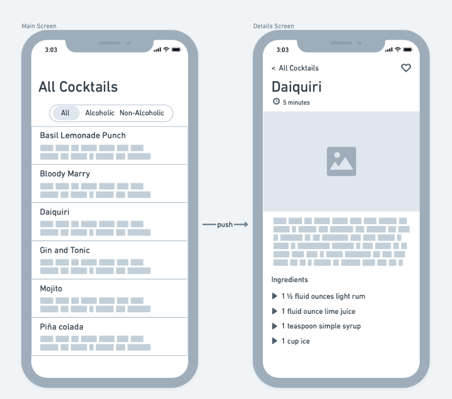
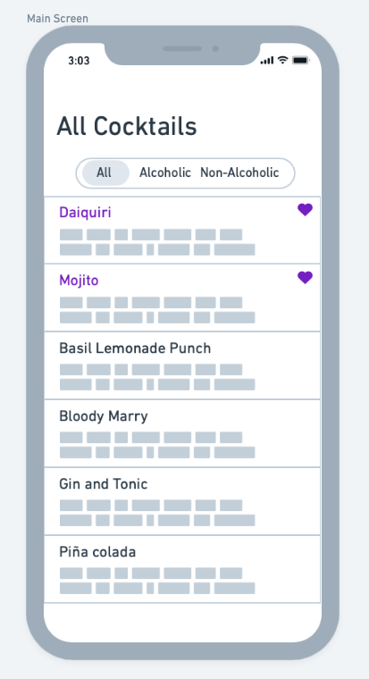

# 🍹 Cocktail Book App Assignment 📱

The contents of this repository consists of starter project as well as this readme file containing instructions. The main goal is to expand and/or refactor the starter project to develop the Cocktails Book app. This assignment consists of required tasks and optional (bonus) tasks. After finishing the assignment, the resulting project should be compressed into a `zip` archive and sent back to the recruiter.

## 🥇 Required tasks

The end goal is to construct an app which will display a list of cocktails provided by the `CocktailsAPI` in the app's Main Screen and details for each of the cocktails in a Details Screen, which is shown whenever one of the cocktails is selected. Further description about the `CocktailsAPI`  is provided later. Please see the mocks below:

<p align="center">
    
</p>

### Main Screen (initial state)

The main screen should:

- Display a list of the cocktails in an alphabetical order
- Each of the items in the list should display the cocktail name and the cocktail's short description
- Provide a UI that will toggle between 3 filter states: all cocktails, alcoholic cocktails and non-alcoholic cocktails. Depending on which filter is selected, the appropriate cocktails should be displayed and the list should be updated. The default filter state should be all cocktails
- Include a navigation title where the text depends on the state of the filter
- Provide behavior where tapping on any of the cocktails in the list should present the Details Screen

### Details Screen

The details screen describes a specific cocktail and should:

- Display a navigation title where the text is the selected cocktail
- Provide a back button to be able to navigate back to the main screen
- Provide an icon and text describing the preparation time of the cocktail
- Display an image of the cocktail. The images provided are of varying sizes, please make sure that the size and aspect ratio of the displayed image is the same for each cocktail
- Provide text where the contents is the cocktail's long description
- Display a list of ingredients (icon and text) that are required for making the cocktail
- Provide an icon toggle button (see the top right corner of the screen in the mocks) which can set the cocktail as "Favorite" or toggle it off for a cocktail that is already "Favorite". In the mocks the icon is represented by a heart icon, when the button is toggled off, the icon should be "empty" and when it is toggled on the icon should be "filled"

<p align="center">
    
</p>

### Main Screen (with favorites)

When some of the cocktails are selected as favorites, the main screen should:

- Always display the favorite cocktails at the beginning in the list (pinned) respecting the filter state (non-alcoholic favorite cocktails should still not be displayed in when the alcoholic cocktails filter is active). The favorite and non-favorite section of the list should still maintain relative alphabetical order
- Each of the items in the list that are favorite, should have a different color for the cocktail name and display the favorite "filled heart icon" in the top right corner of the item UI, with the same color as the cocktail name

### Starter Project Setup & Cocktails API

The first step is to clone the project (do not download zip) by performing this command in your terminal

```bash
git clone https://github.com/wios8/CocktailBook.git
```

Any changes you make to the code should be committed into the cloned local repository with appropriate commit messages.

The project is set to have minimum deployment target iOS 13.2, this is intentional because our flagship app uses the same minimum deployment target, so please do not change it. The project is set only for the iPhone device to limit the scope.

There are two main folders (groups) which are important to notice. `CocktailsAPI` and `CocktailBook`. The CocktailBook is the folder where you will do all the development in, the actual app. Additionally the CocktailBook folder contains `Assets.xcassets` that is pre-populated with cocktails images.
The CocktailsAPI is a collection of premade code to emulate an actual web API, a source for the list of cocktails.

When running the app initially you should be able to see a simple single screen app with some scrollable text (JSON) which is provided by the CocktailsAPI. 
The API provides 2 ways of obtaining the cocktails `Data`, a function with a completion handler and a Combine publisher computed property. They both achieve the same goal, so only one should be used. Which one is used is not important, it is there to provide a choice.

```swift
protocol CocktailsAPI: AnyObject {
    
    var cocktailsPublisher: AnyPublisher<Data, CocktailsAPIError> { get }
    func fetchCocktails(_ handler: @escaping (Result<Data, CocktailsAPIError>) -> Void)
}
```
> the starter code uses the `fetchCocktails` inside the `MainScreenViewController`

To initialize the CocktailsAPI object, you must construct it using the fake / simulated implementation like so:

```swift
let cocktailsAPI: CocktailsAPI = FakeCocktailsAPI()
```

It is important to use the code from the CocktailsAPI folder "as is", meaning you do not need to change anything in the API to achieve the required and most of the optional tasks.

The `Data` which is provided from either of the API functions contains a `UTF8` encoding of a JSON string. The JSON is an array of objects, each representing a cocktail:

```json
[
    {
        "id": "0",
        "name": "Piña colada",
        "type": "alcoholic",
        "shortDescription": "Velvety-smooth texture...",
        "longDescription": "The Piña Colada is a Puerto Rican rum drink...",
        "preparationMinutes": 7,
        "imageName": "pinacolada",
        "ingredients" : [
            "4 oz rum",
            "3 oz fresh pineapple juice...",
            "2 oz cream of coconut...",
            "1 ounce freshly squeezed lime juice (optional)",
            "2 cups ice",
            "Fresh pineapple, for garnish"
        ]
    }
]
```
> The snippet just shows one cocktail object with truncated texts but the API provides 13 cocktail objects in the array

All the cocktail JSON objects have the same properties and most of them are self explanatory. The only ones I want to emphasize are the `imageName` and `type`. To avoid over-complicating the task the `imageName` property contains a name of an image that is already part app's bundle, in this case `pinacolada` is an image inside the `Assets`. The `type` property can contain only two values `alcoholic` and `non-alcoholic`.

The `CocktailAPIError` is not important for developing the required tasks, it is there only if you choose to complete one of the optional tasks (handling errors). 

_An important thing to note is that the API is very slow_, so keep that in mind when designing / implementing the app.

### Design and Implementation Considerations

- The choice of Apple Frameworks is not restricted. You can use either UIKit or SwiftUI, usage of frameworks like Combine is optional but not required
- Feel free to use whatever app architecture you feel most comfortable with (MVC, MVVM, MVVM-C, Clean Swift, etc.), however, you should be able to justify the chosen architecture when asked, explaining all the pros and cons, as well as why you have decided to use that particular architecture 
- The mocks are there to provide guidance, but it is not required to implement a pixel perfect representation of them. As long as the requirements are met the choice of design is very open
- Icons are not provided in the assets, so use appropriate SF Symbols
- The app should have a proper UI in both light and dark mode
- While good looking design is nice, it is not the main criteria by which the app is assessed. Clean, readable and maintainable code is more important
- Use of third party code is not needed to complete either the required or optional tasks, however there are no restrictions of using any. There should be a very good reason to use third party code over the APIs provided by iOS
- Try and adhere to Apple's [Human Interface Guidelines](https://developer.apple.com/design/human-interface-guidelines/) as much as possible

## ❓ Optional (Bonus) Tasks

**Provide unit tests**. Make sure the code is "testable" and provide unit tests for the business logic.

**Persist a list of favorite cocktails**. Setting cocktails as favorite is good while using the app but once the app is closed and launched again, all the favorite cocktails will be gone. Provide a way to persist the user choice so that when next launching the app, the choice of favorite programs is "remembered".

**Handle errors from the CocktailsAPI**. While working on the main tasks, the API will never fail. However there is an option to initialize the `FakeCocktailsAPI` such that it will fail for couple of times before succeeding.

```swift
let cocktailsAPI: CocktailsAPI = FakeCocktailsAPI(withFailure: .count(3)) 
```
By initializing the object using `withFailure: .count(3)`, all the calls to the API will fail 3 times before succeeding. The only error that the API can fail with is `CocktailsAPIError.unavailable`. When the error occurs make sure to appropriately update the UI and inform the user, with an option to somehow retry to fetch the list of cocktails.

**Extract the CocktailsAPI (contents of CocktailsAPI folder/group) into a separate swift package**. The new package should still belong to the same repository as our app. Keep in mind that some things need to be changed in the CocktailsAPI files, not the behavior itself. The new package should be utilized by the app as a local swift package.

**Free to add additional features/design**. There is no clear goal for this task, it is a way to enrich the app by any means you think are interesting. Sky is the limit :)

## 🤓 Disclaimer

The texts and images are taken from multiple sources. They should not be shared with others or used in commercial products, they are only used to serve the assignment as temporary assets, nothing more.